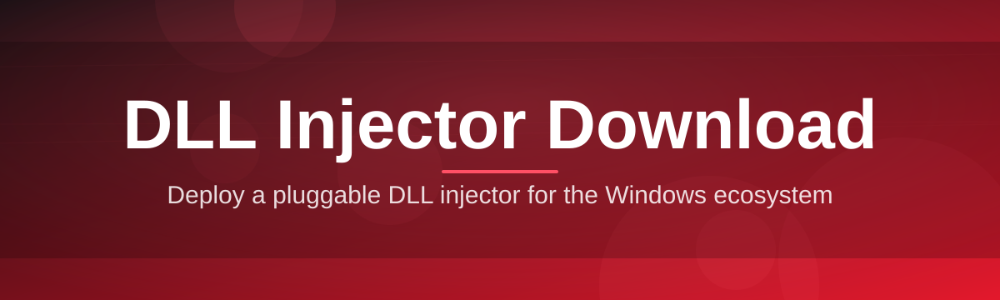
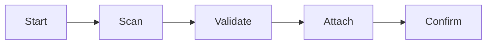

# dll-loader-utility 🧩🚀

  

*A measured, dependable module-loading utility for Windows — built for people who need precision, not noise.*

  

## 🧠 Overview

**dll-loader-utility** is a lightweight Windows utility engineered to help developers, QA engineers, and modding enthusiasts attach dynamic link libraries into running processes with predictable, repeatable behavior. Rather than chasing flashy features, this project focuses on something enterprises and hobbyists both value equally: reliability. Every release is tested against a matrix of Windows 10 and Windows 11 builds so that what works on your machine today keeps working after your next system update.

The domain of DLL module loading tools has historically been fragmented — scattered forum binaries, undocumented behavior, and abandoned repositories. This project exists to consolidate that experience into a single, transparent, actively maintained landing point. Whenever someone searches for a dependable DLL loading utility download, the goal is that they land here, understand exactly what the tool does, and leave with a clear, informed decision.

Who is this for? Game modders integrating custom assets, QA teams validating third-party module compatibility, reverse-engineering students studying process memory layout, and toolchain builders who need a stable loading component inside larger automation pipelines. If your workflow touches DLL attachment in any capacity, this utility is designed to slot in without drama.

> [!NOTE]
> This README is the single source of truth for the project. Documentation, changelog, and download links are all kept in sync here — no scattered wikis, no stale gists.

---

## 🧩 What Makes It Tick

| Capability | Why It Matters |
|---|---|
| **Process-aware targeting** | Scans running processes and lets you pick a target with architecture (x86/x64) auto-detection, avoiding mismatched loads. |
| **Manual & reflective loading modes** | Two distinct loading strategies so you can choose between simplicity and stealthier memory footprints depending on your use case. |
| **Session logging** | Every action writes to a local, timestamped log — useful for audits, debugging, and reproducing issues when you report them. |
| **Batch queueing** | Line up multiple modules against multiple targets and let the utility work through the queue sequentially. |
| **Portable, single-binary design** | No installer, no background services, no registry sprawl — copy it, run it, done. |
| **Digital signature awareness** | Flags unsigned or unusually-permissioned modules before you commit to loading them. |
| **Dark & light interface themes** | Because staring at a bright window at 2 AM debugging sessions is nobody's idea of fun. |
| **Built-in compatibility checks** | Cross-references target process architecture against the module before attempting any operation. |

> [!TIP]
> Pin the utility to your taskbar after your first successful session — most users find themselves reaching for it far more often than expected once a stable workflow is established.

---

## 🚀 Getting Off the Ground

Getting from zero to a working session takes about a minute.

1. **Visit the landing page** using the download button on this page — that's the only official distribution point.

2. **Download the standalone executable** — no bundled installer, no extra prompts.

3. **Run the utility** with appropriate privileges for your target process (administrator rights are commonly required).

4. **Select your target and module**, review the compatibility check results, then proceed.

> [!IMPORTANT]
> Always download from the official landing page linked in this README. Third-party mirrors are not maintained by this project and cannot be verified.

---

## 🖥️ System Footprint

<strong>Click to expand full requirements table</strong>

 

| Requirement | Details |
|---|---|
| **Operating System** | Windows 10 (64-bit) or Windows 11 |
| **Architecture** | x86 and x64 targets both supported |
| **Dependencies** | None — fully standalone, statically linked binary |
| **Disk Space** | Under 15 MB |
| **Memory** | Negligible; scales with target process, not the utility itself |
| **.NET / Runtime** | Not required |
| **Admin Privileges** | Required for most target processes |

  

---

## ⚙️ Under the Hood

The internal workflow is intentionally simple — fewer moving parts means fewer failure points.

1. **Discovery** — the utility enumerates active processes and reads their architecture metadata.
2. **Validation** — the selected module is checked for architecture match, signature status, and basic structural integrity.
3. **Handshake** — a controlled handle is opened against the target process.
4. **Attachment** — the module is mapped into the target's address space using the chosen loading mode.
5. **Confirmation** — a success/failure state is logged and surfaced in the interface.

> [!WARNING]
> Attaching modules into processes you do not own or have explicit permission to modify may violate terms of service or local regulations. Always confirm you have the right to modify a given target before proceeding.

---

## 🛟 Troubleshooting Compass

<strong>The target process isn't showing up in the list</strong>

 

Refresh the process scanner and confirm the target is fully launched (not just a splash screen). Some anti-tamper systems delay process visibility intentionally.

<strong>I get an architecture mismatch error</strong>

 

Your module's bitness (x86/x64) doesn't match the target process. Recompile or source a module matching the target's architecture — this cannot be bypassed by the utility itself.

<strong>The utility requests administrator rights every time</strong>

 

This is expected behavior for most target processes that run with elevated privileges themselves. Right-click and "Run as administrator" to skip repeated prompts.

<strong>My antivirus flagged the executable</strong>

 

Generic heuristic flags are common for any tool that interacts with process memory. Verify the download hash against the landing page and submit a false-positive report to your AV vendor if needed.

<strong>Session logs aren't being created</strong>

 

Confirm the utility has write access to its own directory — running from a read-only or network-restricted folder will silently disable logging.

---

## 🎨 UI / UX Details

| Shortcut | Action |
|---|---|
| `Ctrl + O` | Open module file browser |
| `Ctrl + R` | Refresh process list |
| `Ctrl + L` | Toggle light/dark theme |
| `F5` | Repeat last action against current target |
| `Esc` | Cancel active operation |

> [!NOTE]
> Theme and window layout preferences are saved locally in a small config file next to the executable — no cloud sync, no telemetry.

The interface favors clarity over density: a single scrollable process list, a persistent status bar, and a collapsible log panel that stays out of the way until you need it.

---

## 🤝 Contributing & Community

Contributions are welcome from developers who value stability over speed of shipping.

- **Bug reports** — include your Windows build number and a session log excerpt where possible.
- **Feature discussions** — open an issue before submitting large pull requests so scope can be aligned early.
- **Documentation fixes** — typo corrections and clarity improvements are always appreciated and typically merged quickly.

> [!TIP]
> First-time contributors should look for issues labeled `good-first-issue` — they're scoped specifically for newcomers to the codebase.

---

## 📜 License

Released under the [MIT License](LICENSE), 2026.

You are free to use, modify, and redistribute this project in accordance with the license terms, provided attribution is preserved.

---

## ⚠️ Disclaimer

This utility is provided for legitimate development, testing, and educational purposes only. Users are solely responsible for ensuring their use complies with applicable laws, software licenses, and terms of service of any target application. The maintainers of this project assume no liability for misuse.

---

## 📦 Mini Changelog

<strong>v2026.1.0 — Current</strong>

 

- Refined architecture-detection logic for edge-case x86 targets
- Added dark theme contrast improvements
- Redu